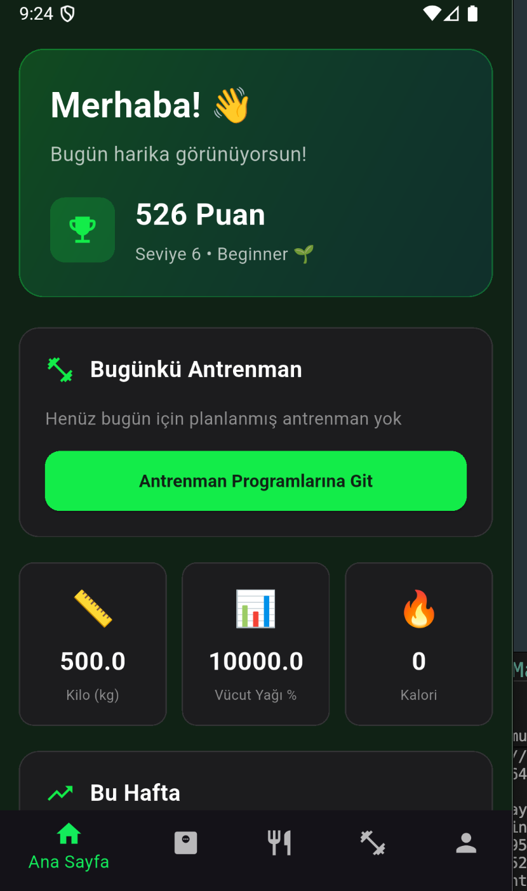
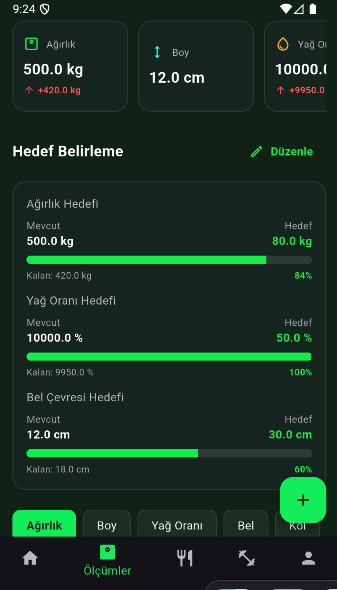
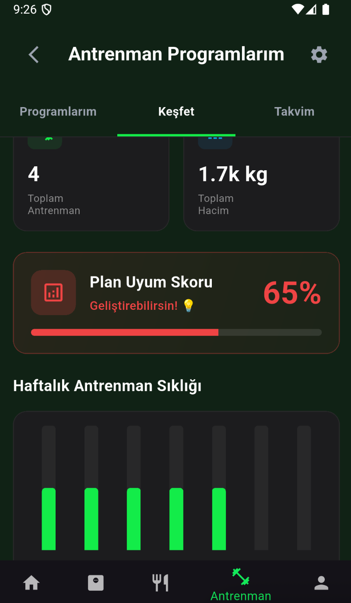
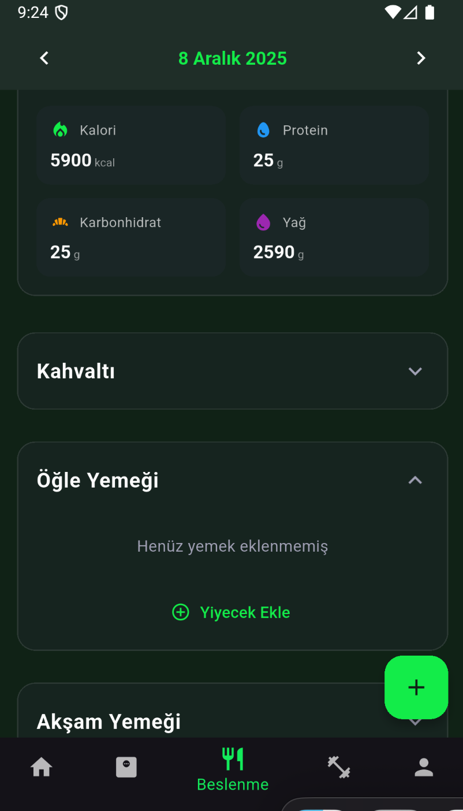
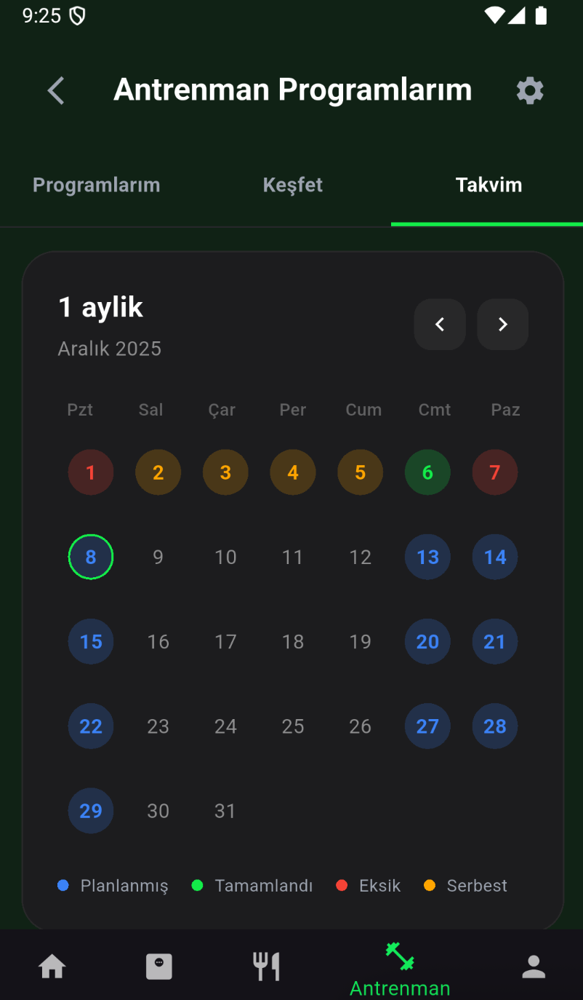

💪 Fitness Tracker App

Antrenmanlarını, beslenmeni ve vücut ölçümlerini tek bir yerden takip etmeyi sağlayan modern fitness uygulaması.

📱 Özellikler
🏋️ Antrenman

Kişiselleştirilmiş antrenman programları

Egzersiz kütüphanesi

Set/tekrar takibi

Takvim görünümü

Hacim & performans grafikleri

--------------------------------

🥗 Beslenme

Günlük kalori hesaplama

Protein / Karbonhidrat / Yağ takibi

Öğün yönetimi

Geçmiş kayıtlar

--------------------------------

📏 Vücut Ölçümleri

Kilo, yağ oranı, kas kütlesi

Bel, göğüs, kol vb. ölçümler

Zaman içinde ilerleme grafikleri

BMI & ideal kilo hesaplama

🎯 Hedef ve Puan Sistemi

Günlük hedefler

Aktivite bazlı motivasyon puanları

📊 Analizler

Haftalık - aylık raporlar

En çok yapılan egzersizler

Hacim & performans analitikleri

--------------------------------

🏗️ Mimari
lib/
├── core/           # Provider, servisler, yardımcı fonksiyonlar
├── features/       # Modül bazlı yapı
│   ├── workouts/
│   ├── nutrition/
│   ├── profile/
│   ├── dashboard/
│   └── tracking/
├── models/         # Isar modelleri
└── navigation/     # GoRouter yapılandırması

--------------------------------

🛠️ Kullanılan Teknolojiler

Riverpod

Isar Database

GoRouter

FL Chart

Provider

------------------------------

🚀 Kurulum
git clone https://github.com/ServetErdogan09/fitness_app.git
cd fitness_app
flutter pub get
flutter pub run build_runner build --delete-conflicting-outputs
flutter run

--------------------------------

  
  
    

  
  

--------------------------------

🗺️ Roadmap

Besin veritabanı

Video egzersiz rehberleri

Cloud senkronizasyon

Dark mode

--------------------------------

👤 Geliştirici

Servet Erdoğan
GitHub: @ServetErdogan09
